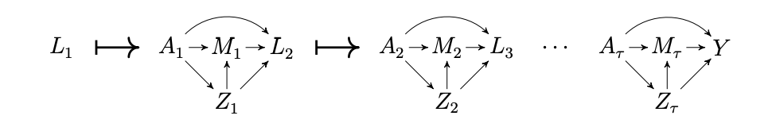

# LCM MTP Application

Code to analyze the direct and indirect effects through acute kidney injury (AKI) of a delay in intubation policy on COVID-19 mortality using the [`lcmmtp`](https://github.com/nt-williams/lcmmtp) R package.

## Data cleaning

1. First, we filtered for cohort eligibility criteria (e.g. age >= 18, no chronic kidney disease) in `scripts/0_create_cohort.R`.

2. Then, we selected for the relevant date-times for creating the wide, discrete time window data structure in later steps in `scripts/1-create_date_times.R`. These included:

- `t1_start` : date-time of study start, arrival to the hospital

- `A_time` : date-time of exposure, intubation, if applicable

- `M_time` : date-time of mediator, AKI, if applicable

- `Y_time` : date-time of outcome, death, if applicable

- `Cens_time` : date-time of censoring event, discharge or transfer, if applicable

- `max_time` : date-time of outcome or censoring

At this step we also filtered out <0.6% of patients with non-sensical date-times due to errors in data collection.

3. Next, we created variables `window`, `l_start`, `l_end`, `z_start`, and `z_end` to indicate what the date-time should be for each time window $t \in 1, \dots, \tau$ and random variable $L_t$ and $Z_t$.

- `window` : discrete time window $t$

- `l_start` : date-time indicating start of $L_t$ measurement

- `l_end` : date-time indicating end of $L_t$ measurement

- `z_start` : date-time indicating start of $Z_t$ measurement

- `z_end` : date-time indicating end of $Z_t$ measurement

To enforce temporality in the time-discretized data structure, intervals depended on whether the patient was intubated (before AKI, if applicable), met AKI criteria (before intubation, if applicable), or was neither intubated nor met AKI criteria during the study follow up.

**A. Time intervals for patients who **never** were intubated nor met criteria for AKI:**

- Time windows were created by sequencing `t1_start` to the maximum time (`max_time`) in the study (i.e. `Y_time` or `Cens_time`) in as close to 24 hour intervals as possible.
- The start of each sequence was `l_start` and the end of each sequence was `z_end`, where `z_end` was the next window's `l_start` value with 1 second removed.
- The midpoint of `l_start` and `z_end` was determined and used to create `l_end` and `z_start`, again differing by 1 second each.

**B. Time intervals for patients who met criteria for AKI before being intubated, or who were never intubated:**

- Time windows were created by first sequencing `t1_start` to the time that AKI criteria was met (`M_time`) in as close to 24 hour intervals as possible. Then, `M_time` until `max_time` was sequenced in as close to 24 hour intervals as possible.
- The start of each sequence was `l_start` and the end of each sequence was `z_end`, where one of the `z_end` values corresponded to the exact time the patient met AKI criteria. This ensured that all variables measured in $Z_k$ (where $k$ indicates the interval in which AKI occurred (i.e. $M_k=1$)) were measured before the mediator. It also ensured that all variables in the next $L$, i.e. $L_{k+1}$, were measured after the mediator.
- Some patients who met criteria for AKI were intubated later. To ensure correct temporality, i.e. that $L_j$ occurred before $A_j$ and $Z_j$ occurred after $A_j$, where $j$ is the time window in which the patient was intubated, the `l_end` and `z_start` variables for the time window in which intubation occurred were modified to reflect the time of intubation, rather than the midpoint of `l_start` and `z_end`.

**C. Time intervals for patients who were intubated before meeting criteria for AKI, or who never met criteria for AKI:**

- Time windows were created by first sequencing `t1_start` to the time that intubation was met (`A_time`) in as close to 12 hour intervals as possible, where the number of intervals was odd. Then, `A_time` until `max_time` was sequenced in as close to an odd number of 12 hour intervals as possible. The 12 hour intervals were sequenced in this way because `A_time` needed to have $L_t$ variables before it, and $Z_t$ variables after it. Put another way, $A_t$ falls in the middle of a 24 hour interval $t$.
- Every *odd* date-time in the above sequence was called `l_start` (except for the last odd date-time, which was called `l_end`) and every *even* date-time in the sequence was called `z_start`.

4. The start/stop date-time variables were used to divide up date-time-stamped covariates into the correct $L_t$ and $Z_t$ window. This was done using the function `divide_labs()` in `scripts/0-functions.R`. A variable was created for every covariate at every time point to indicate "missing" or "not missing" measurement. Missing measurements were substituted with -99999. The correct exposure levels, mediator levels, outcomes, and censoring variables at each time point were also created at this step. The final data structure after this was long (`empi`, `window`, `L`, `A`, `Z`, `M`, `C`, `Y`), with one row per time window that each patient was in the study (i.e. there could be 3 rows for Patient 1, 12 rows for Patient 2).

5. The `window` from Step 4 were filtered to only contain the first 28 days of the study, as the maximum study length planned for this retrospective data was 28 days from hospitalization to evaluate the commonly assessed outcome of 28-day mortality. Then, the data were pivoted into wide format to contain variables:

- `empi` : Unique patient identifer.

- `L_value_t_*` : $L_t$ variables indicating the value if measured, or LOCF if not measured but a previous value was measured, or -99999 if no previous value present to carry forward
 
- `L_missing_t_*` : $L_t$ variables indicating the value was missing

- `A_t` : Patients supplemental oxygen status at time $t$ which takes values `0` = no supplemental oxygen, `1` = non-invasive supplemental oxygen support, and `2` = invasive mechanical ventilation.

- `Z_value_t_*` : $Z_t$ variables indicating the value if measured, or LOCF if not measured but a previous value was measured, or -99999  if no previous value present to carry forward
 
- `Z_missing_t_*` : $Z_t$ variables indicating the value was missing

- `M_t` : Indicator for the patient meeting criteria for AKI by time window $t$.

- `Y_t` : Indicator for death at the end of time window $t$. Once $Y_t = 1$, the outcome is deterministic (equal to 1).

- `Observed_t` : An indicator for patient having an outcome `Y_t` *observed*. Thus, this is `1` until the window in which the patient is discharged, when it becomes `0`.

## Analysis

**Software:**

**Superlearner candidates:** `glm`, `lightgbm`, `earth`, `glmnet`

### TO DO:

- make a new level for respiratory support
- add in co-prescriptions?
